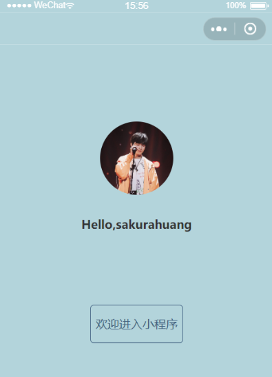
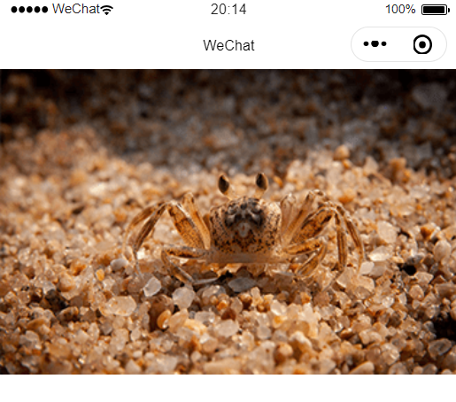

## 基础知识

## 小程序文件类型与目录结构

#### project.config.json

用于配置小程序开发者工具的字号，行号等编辑格式。（在另一台电脑编辑的时候，可以同步编辑器的显示格式）

#### pages目录

- pages
  - index
  - logs
  - ......

pages下面，一个目录就代表一个页面

#### app.json

`app.json` 文件用来对微信小程序进行全局配置，决定页面文件的路径、窗口表现、设置网络超时时间、设置多 tab 等。

当新开一个页面的时候，在 `app.json` 里面加如下配置

```json
{
  "pages": [
    "pages/welcome/welcome"
  ],
 }
```

## 注册小程序页面

#### 小程序单位rpx

随着机型的分辨率和尺寸不同，自动响应。

用小程序工具打开图片，右下角会显示1024*1024

- 如果要保持图片原来的尺寸 —— 

各个机型有所不同，详细请前往官网文档-搜索关键词：WXSS，尺寸单位

- 举例

换算关系，iphone6机型：

样式应该为`width:512px;height:512px` 或者 `width:1024rpx;height:1024rpx`

### Flex弹性盒子模型

一个简单的欢迎页面

具体代码参考`miniprogram_note\code\Movie\pages\welcome`



flex样式重点，利用一层view包裹三部分，实现垂直轴上居中对齐

```
.user-flex{
    display: flex;
    flex-direction:column;
    align-items: center;
}
```

另外三部分，

```
.user-flex > text{
    margin-top:50rpx;
    flex:1;
}
.user-avatar-wrap{
    margin-top:50rpx;
    flex:1;
}
```

设置背景色

```
page{
  height:100%;
  background-color: #b3d4db;
}
```

修改导航栏颜色，`app.json`

```
"window":{
    "navigationBarBackgroundColor":"#b3d4db"
  }
```

### 移动端分辨率及小程序自适应单位RPX

#### 移动设备的分辨率

| 设备          | 屏幕尺寸 | 分辨率(pt)   | Reader | 分辨率(px)    | 渲染后  | PPI(DPI) |
| ----------- | ---- | --------- | ------ | ---------- | ---- | -------- |
| iPhone 6/6s | 4.7寸 | 375 x 667 | @2x    | 750 x 1334 |      | 326      |

#### 问题1：

#### 为什么模拟器下ip6的分辨率是375，而设计图一般给750？

回答 —— 小程序模拟器下，给的分辨率是pt，也就是逻辑分辨率，设计图的750指的是物理分辨率。

所以，设计图的长度，对应到css上面，长度要缩小一半。

- 逻辑分辨率(pt)

逻辑分辨率仅和屏幕尺寸挂钩，长度单位。

- 物理分辨率(px)

与屏幕尺寸没有任何关系。物理像素点，一个pt对应n个px。举例iphone6，一个pt包含2个px

- Reader

同一个pt下面，包含多少个px

- DPI(类似Reader)

每英寸包含多少个px，（4.7为屏幕的对角线）计算公式为 `(sqrt(pow(750,2)+pow(1334,2)))/4.7`

#### 问题2

#### 如何做到不同分辨率设备的自适应（rpx的作用）？

以iphone6的物理像素750 x 1334为视觉稿进行设计

Ip6 下 1px = 1rpx = 0.5pt

使用rpx，小程序会自动在不同分辨率下进行转换，使用px为单位不会

下面这张图片，尺寸是375 x 230



那么要实现自适应，先把调试机型调到Ip6，然后设置尺寸为 `width:750rpx;height:460rpx;`

## 全局配置vs页面配置

### 全局配置

小程序根目录下的 `app.json` 文件用来对微信小程序进行全局配置，决定页面文件的路径、窗口表现、设置网络超时时间、设置多 tab 等。

### 页面配置

注意 ：

> 页面配置中只能设置 `app.json` 中 `window` 对应的配置项，以决定本页面的窗口表现，所以无需写 `window` 这个属性。